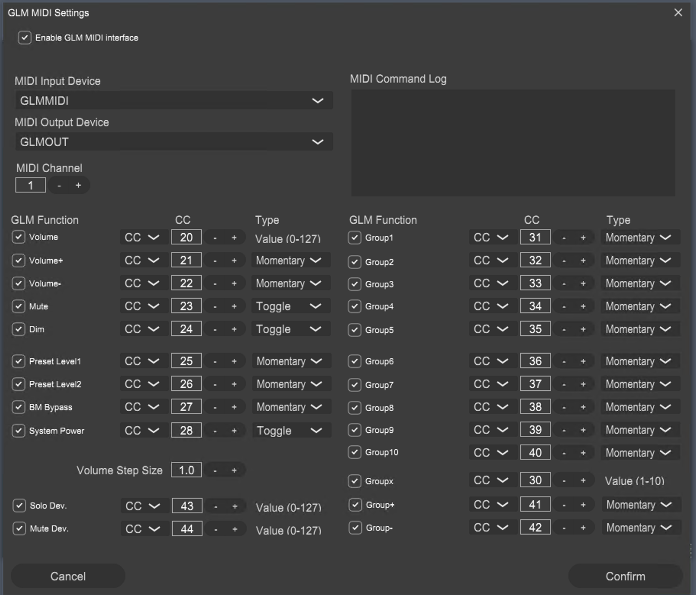

# VOL20toGenelecGLM

A bridge between a **Fosi VOL20** Bluetooth volume knob and **Genelec GLM** speaker management software. Translates USB HID input into MIDI control messages, giving you physical knob control over volume, mute, dim, and power — with a REST API, WebSocket streaming, web UI, and Home Assistant integration via MQTT.

Built as a single Go binary. No runtime dependencies, no installers — just copy and run.

## Features

- **Physical volume knob** — smooth, responsive control with configurable acceleration
- **Full GLM control** — volume (absolute + relative), mute, dim, power on/off
- **Deterministic power** — idempotent CC28 commands (ON stays ON, OFF stays OFF)
- **REST API + WebSocket** — real-time state for custom dashboards and automation
- **Home Assistant MQTT** — auto-discovered entities with volume slider, mute/dim/power switches
- **Headless VM support** — RDP priming, MIDI service restart, GLM process management, watchdog
- **External power detection** — recognizes RF remote power toggles and follows through with CC28

## Requirements

| Component | Purpose | Notes |
|-----------|---------|-------|
| [Genelec GLM v5](https://www.genelec.com/glm) | Speaker management software | MIDI must be enabled in GLM Settings |
| [LoopMIDI](https://www.tobias-erichsen.de/software/loopmidi.html) | Virtual MIDI ports | Create two ports: `GLMMIDI` and `GLMOUT` |
| Fosi VOL20 | Bluetooth USB HID knob | Pair via Windows Bluetooth settings |
| [FreeRDP](https://github.com/FreeRDP/FreeRDP/releases) | RDP session priming | Headless VM only — `wfreerdp.exe` in PATH |

### GLM MIDI Configuration

1. Open GLM → Settings → MIDI
2. Enable **"Enable GLM MIDI interface"**
3. Set MIDI Input Device to **GLMMIDI**, Output Device to **GLMOUT**
4. Set **System Power** (CC 28), **Mute** (CC 23), and **Dim** (CC 24) Type to **"Toggle"** — this enables deterministic ON/OFF control. "Momentary" is a blind toggle and will cause state drift.
5. Click **Confirm**



## Installation

### Option A: Download Binary

Download the latest `vol20toglm.exe` from [Releases](https://github.com/gahabana/VOL20toGenelecGLM/releases). Place it anywhere — no installation needed.

### Option B: Build from Source

**Prerequisites:** [Go 1.22+](https://go.dev/dl/) and [Git](https://git-scm.com/downloads)

```cmd
git clone https://github.com/gahabana/VOL20toGenelecGLM.git
cd VOL20toGenelecGLM\go
go build -ldflags="-s -w" -o vol20toglm.exe .
```

The `-s -w` flags strip debug symbols for a smaller binary (~7 MB).

#### Build from Source on a Fresh Windows 11 Machine

1. **Install Go** — download the `.msi` from [go.dev/dl](https://go.dev/dl/), run the installer. Adds `go` to PATH automatically. Verify: `go version`
2. **Install Git** — download from [git-scm.com](https://git-scm.com/downloads), run the installer with defaults. Verify: `git --version`
3. **Clone and build:**
   ```cmd
   git clone https://github.com/gahabana/VOL20toGenelecGLM.git
   cd VOL20toGenelecGLM\go
   go build -ldflags="-s -w" -o vol20toglm.exe .
   ```
4. That's it. No C compiler, no SDKs, no package managers. Go downloads dependencies automatically on first build.

## Quick Start

**Desktop user** — GLM already running, you're sitting at the screen:

```cmd
vol20toglm.exe --no_glm_manager --no_rdp_priming --no_midi_restart --no_ui_automation
```

**Headless VM** — full automation (launches GLM, primes RDP, restarts MIDI):

```cmd
vol20toglm.exe --headless
```

**With Home Assistant** — add MQTT broker connection:

```cmd
vol20toglm.exe --mqtt_broker 192.168.0.100 --mqtt_user ha_user --mqtt_pass ha_password
```

**Device discovery** — list available HID devices and MIDI ports:

```cmd
vol20toglm.exe --list
```

## CLI Reference

### Essential Flags

| Flag | Default | Description |
|------|---------|-------------|
| `--device` | `0x07d7,0x0000` | USB HID device VID,PID in hex |
| `--midi_in_channel` | `GLMMIDI` | MIDI port to send commands to GLM |
| `--midi_out_channel` | `GLMOUT` | MIDI port to receive state from GLM |
| `--api_port` | `8080` | REST API / web UI port (0 to disable) |
| `--log_level` | `DEBUG` | `DEBUG`, `INFO`, or `NONE` |

### MQTT / Home Assistant

| Flag | Default | Description |
|------|---------|-------------|
| `--mqtt_broker` | *(empty)* | MQTT broker hostname (empty = disabled) |
| `--mqtt_port` | `1883` | MQTT broker port |
| `--mqtt_user` | *(empty)* | MQTT username |
| `--mqtt_pass` | *(empty)* | MQTT password |
| `--mqtt_topic` | `glm` | Topic prefix (`glm/state`, `glm/set/volume`, etc.) |
| `--mqtt_ha_discovery` | `true` | Auto-create entities in Home Assistant |
| `--no_mqtt_ha_discovery` | | Disable HA MQTT Discovery |

When connected, Home Assistant auto-discovers these entities:

| Entity | Type | Controls |
|--------|------|----------|
| Genelec GLM (device toggle) | Switch | Power on/off |
| GLM Volume | Number | -127 to 0 dB |
| GLM Mute | Switch | Mute on/off |
| GLM Dim | Switch | Dim on/off |

### Automation Flags

| Flag | Default | Description |
|------|---------|-------------|
| `--glm_manager` / `--no_glm_manager` | `true` | Launch and monitor GLM process |
| `--glm_path` | `C:\Program Files (x86)\Genelec\GLMv5\GLMv5.exe` | GLM executable path |
| `--rdp_priming` / `--no_rdp_priming` | `true` | RDP session priming at startup |
| `--midi_restart` / `--no_midi_restart` | `true` | Restart Windows MIDI service at startup |
| `--high_priority` / `--no_high_priority` | `true` | Run at AboveNormal process priority |

### Power Control Modes

| Flags | Power | Screen reading | Use case |
|-------|-------|----------------|----------|
| `--no_ui_automation` | MIDI CC28 | Disabled | Desktop — user interacts with GLM directly |
| `--headless` | MIDI CC28 | Enabled | Headless VM — pixel verification + health monitoring |
| `--headless --ui_power` | UI click | Enabled | Fallback if MIDI power unreliable |
| *(no flags)* | MIDI CC28 | Disabled | Same as `--no_ui_automation` |

### Volume Acceleration

| Flag | Default | Description |
|------|---------|-------------|
| `--volume_increases_list` | `1,1,2,2,3` | Volume step per acceleration level |
| `--min_click_time` | `0.2` | Seconds between clicks to reset acceleration |
| `--max_avg_click_time` | `0.15` | Max average click time for acceleration |

## REST API

| Method | Path | Description |
|--------|------|-------------|
| `GET` | `/api/state` | Current state (JSON) |
| `POST` | `/api/volume` | Set volume: `{"value": 0-127}` |
| `POST` | `/api/volume/adjust` | Adjust volume: `{"delta": int}` |
| `POST` | `/api/mute` | Toggle mute, or set: `{"state": bool}` |
| `POST` | `/api/dim` | Toggle dim, or set: `{"state": bool}` |
| `POST` | `/api/power` | `{"state": "on"}`, `{"state": "off"}`, `{"state": "toggle"}` |
| `GET` | `/api/health` | Health check |
| `WS` | `/ws/state` | WebSocket — real-time state updates |
| `GET` | `/` | Web UI |

## Architecture

See [go/README.md](go/README.md) for the full architecture diagram, behavioral constants reference, and implementation details.

```
  VOL20 Knob ──► HID Reader ──► Actions Channel ──► Consumer ──► MIDI Gate ──► GLM
                                      ▲                              │
                               REST API / MQTT                  Controller
                                                                     │
                                                              State Callbacks
                                                              │           │
                                                         WebSocket     MQTT
                                                         Broadcast    Publish
```

## Headless VM Setup

For unattended operation on a Windows VM (e.g., Hyper-V, VMware):

1. **LoopMIDI** — install, create `GLMMIDI` and `GLMOUT` ports, set to auto-start
2. **FreeRDP** — download `wfreerdp.exe`, place in PATH
3. **RDP credentials** — `cmdkey /generic:localhost /user:USERNAME /pass:PASSWORD`
4. **GLM** — install, configure MIDI (see above), save a setup profile
5. **Auto-start** — create a scheduled task or startup script to run `vol20toglm.exe`

See [CLAUDE.md](CLAUDE.md) for detailed RDP priming setup, NLA configuration, and troubleshooting.

## Python Version (Legacy)

The original Python implementation (`bridge2glm.py`) requires Python 3.10+, pip/uv, and several packages including `python-rtmidi` (which needs a C++ compiler). The Go version is a complete rewrite with feature parity and no external dependencies. The Python version is no longer actively developed.

## License

MIT
